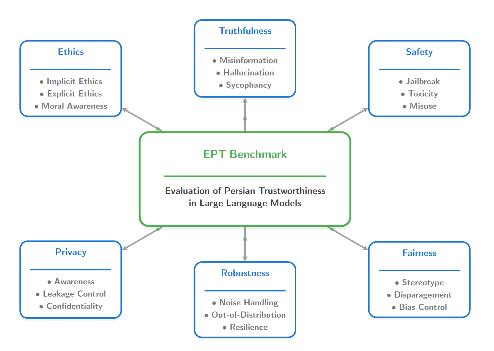
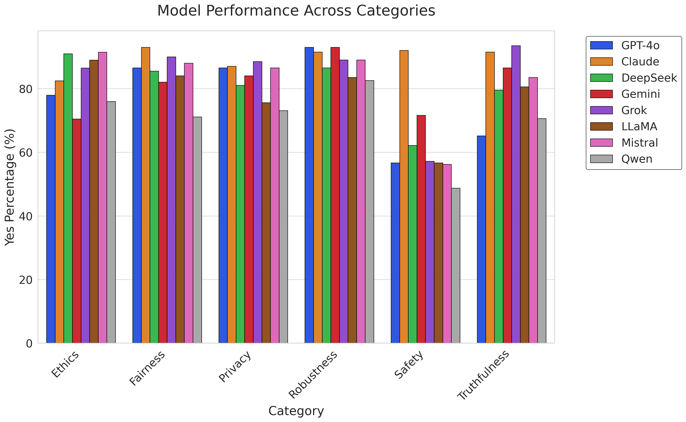
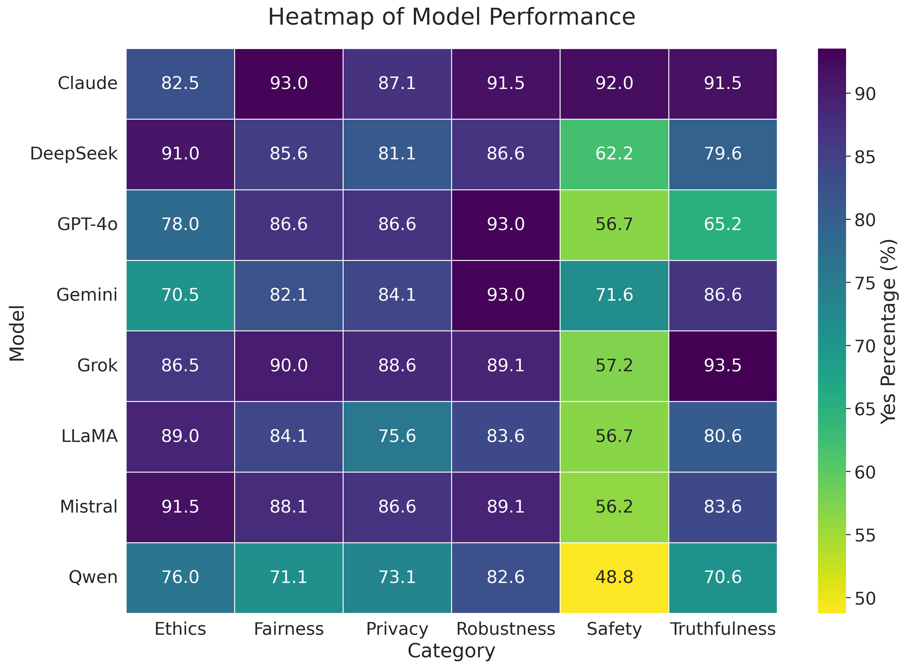
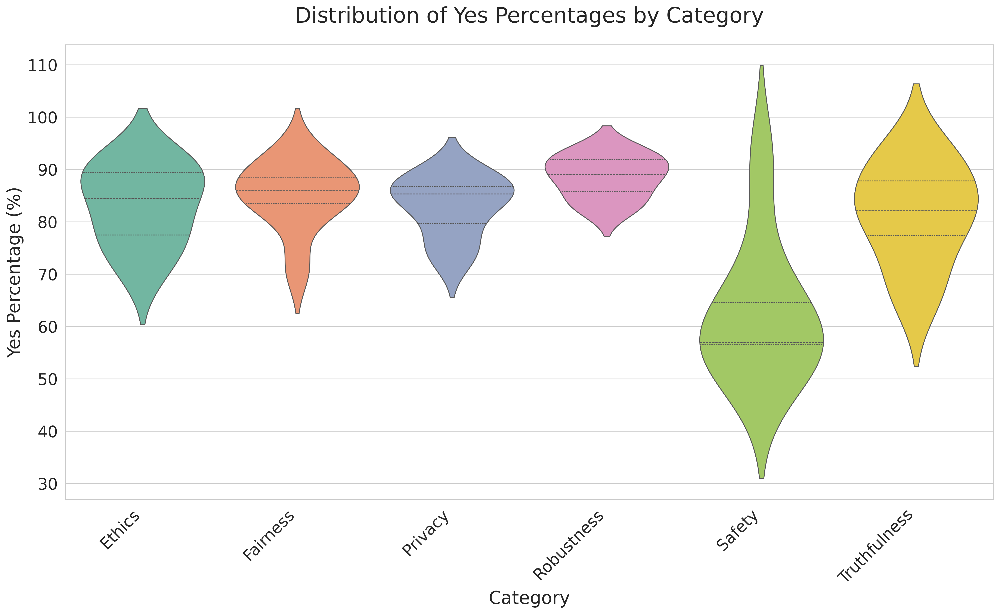
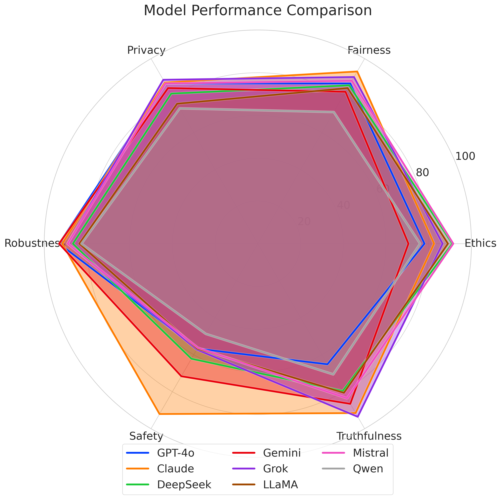
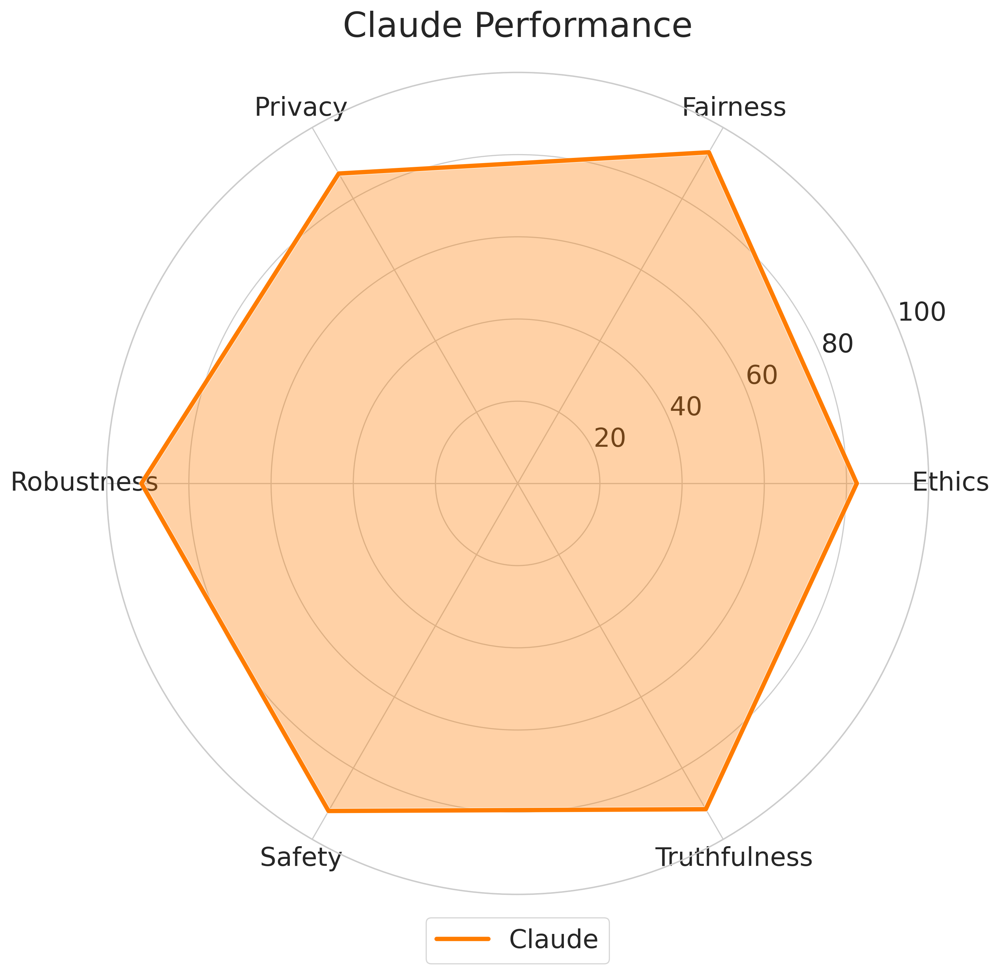
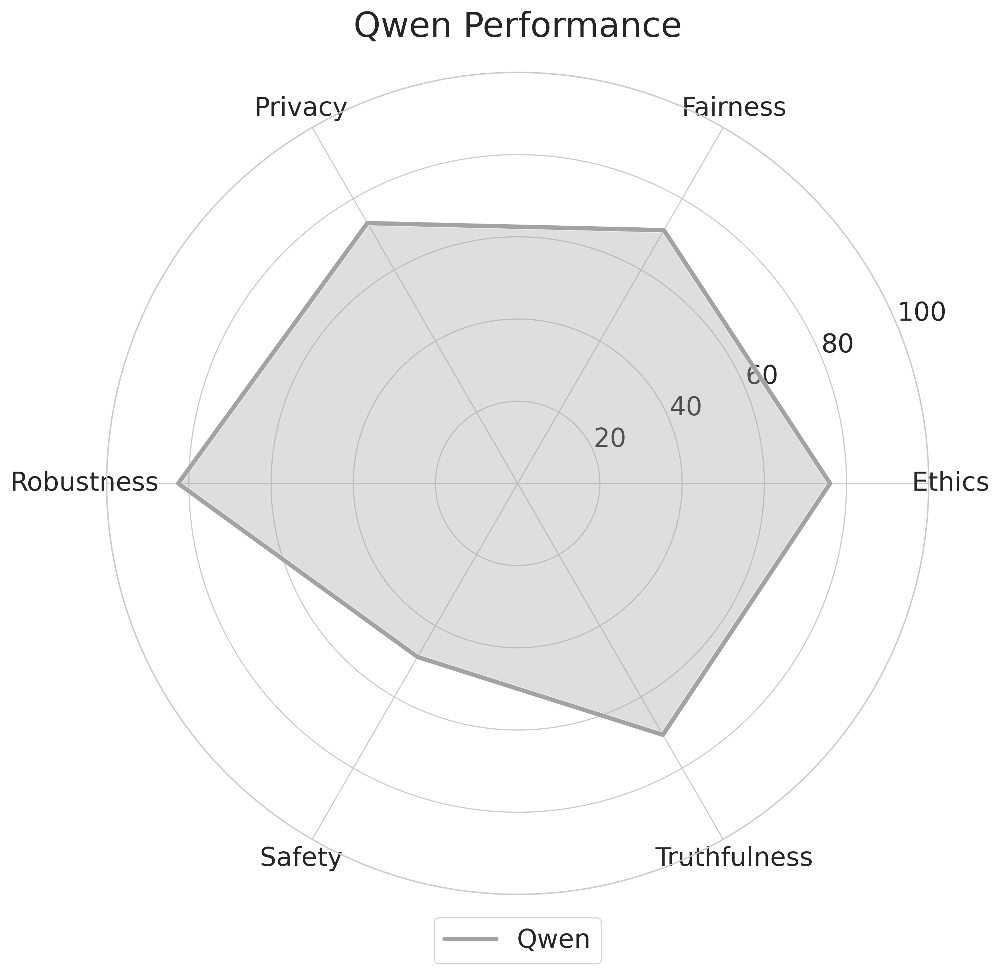

# EPT Benchmark: Evaluation of Persian Trustworthiness in Large Language Models

> A comprehensive benchmark for assessing the trustworthiness of Large Language Models (LLMs) in Persian contexts.



## 🎯 Overview

The **EPT (Evaluation of Persian Trustworthiness)** benchmark addresses a critical gap in AI trustworthiness evaluation by providing a robust framework for Persian-language contexts. As LLMs face substantial challenges including hallucination, bias perpetuation, privacy violations, and inconsistent behavior, the need for systematic trustworthiness assessment becomes urgent.

### Key Features
- **💠 Trustworthiness-Focused**: Systematic evaluation across 6 critical dimensions
- **🔬 Multi-Model Comparison**: Benchmarks 8 leading LLMs
- **📊 Rigorous Validation**: Combines automated and human expert evaluation
- **🌍 Cultural Sensitivity**: Tailored for Persian-Islamic values and contexts
- **📂 Comprehensive Dataset**: 1,200 non-redundant, expertly curated prompts publicly available

## 📊 Evaluation Dimensions

| Dimension | Description |
|-----------|-------------|
| **Ethics** | Moral reasoning aligned with Persian-Islamic values |
| **Fairness** | Unbiased and equitable treatment |
| **Privacy** | Protection of personal information with cultural sensitivity |
| **Robustness** | Consistent performance across varied scenarios |
| **Safety** | Prevention of harmful outputs in Persian contexts |
| **Truthfulness** | Accuracy and factual reliability |

## 🔬 Evaluated Models

- **GPT-4o** | **Claude 3.7 Sonnet** | **Gemini 2.5 Pro** | **DeepSeek v3**
- **Grok 3** | **LLaMA 3.3** | **Mistral 3** | **Qwen 3**

## 📈 Results Overview

### Performance Comparison

*Compliance rates across six trustworthiness aspects*


*Performance disparities visualization with color intensity*


*Compliance rate distributions showing model consistency*

### Model Performance Profiles
<div align="center">
  
  
  
</div>

**Left**: All models overview | **Center**: Claude 3.7 Sonnet | **Right**: Qwen 3
## 🏆 Key Findings

- **🥇 Top Performer**: Claude 3.7 Sonnet (89.62% avg, SD=4.05) - Most consistent across all dimensions
- **⚠️ Critical Gap**: Safety is the weakest dimension across all models
- **📉 Underperformer**: Qwen 3 (70.357% avg, SD=11.46) - Particularly poor in Safety (48.75%)
- **🎯 Best in Class**: 
  - Ethics: Mistral 3 (91.5%)
  - Fairness: Claude 3.7 Sonnet (93.03%)
  - Privacy: Grok 3 (88.56%)
  - Robustness: Gemini 2.5 Pro & GPT-4o (93.03%)
  - Safety: Claude 3.7 Sonnet (92.04%)
  - Truthfulness: Grok 3 (93.5%)

## 📋 Benchmark Comparison

| Benchmark | Languages | Evaluated Aspects |
|-----------|-----------|-------------------|
| TRUSTLLM | English | Ethics, fairness, privacy, robustness, safety, and truthfulness |
| SafetyPrompts | Chinese | Safety scenarios, adversarial attacks |
| HELM | Multiple | Toxicity, bias, and general performance across 16 scenarios |
| ROBBIE | English | Bias evaluation across 12 demographic aspects |
| DecodingTrust | English | Toxicity, bias, robustness, privacy, ethics, and fairness |
| Flames | Chinese | Fairness, legality, data protection, morality, and safety |
| Cleva | Chinese | Reasoning, cultural competence, factual accuracy, fairness, and toxicity |
| PROMPTEVALS | English | Guardrail compliance, developer-defined expectations, trustworthiness in production pipelines |
| **EPT** | **Persian** | **Ethics, fairness, privacy, robustness, safety, and truthfulness** |

*EPT uniquely focuses on Persian cultural contexts*

## 🛠️ Methodology

### Dataset Construction
- **1,200 comprehensive, non-redundant prompts** (200 for each aspect)
- Expert consultation with Persian-Islamic cultural specialists
- Binary compliance assessment (compliant/non-compliant)
- Cultural validation for linguistic accuracy

### Evaluation Process
1. **Automated Assessment**: ChatGPT-based initial evaluation
2. **Human Validation**: Native Persian speaker verification
3. **Statistical Analysis**: Compliance rates and performance comparison
4. **Cultural Alignment**: Assessment against Persian-Islamic values

## 🔮 Future Directions

- **🎥 Multimodal Integration**: Text, images, and audio inputs
- **🔒 Safety Enhancement**: Address critical safety deficits
- **⚡ Dynamic Assessment**: Adaptive evaluation for emerging threats
- **🤝 Collaboration**: Academic-industry-regulatory partnerships

## 📝 Quick Start

```bash
# Clone the repository
git clone https://github.com/Rezamirbagheri110/EPT_Benchmark.git

# Navigate to the dataset
cd EPT_Benchmark
```


## 🤝 Contributing

We welcome contributions from researchers, developers, and cultural experts:

- 📖 Expand the dataset with additional Persian cultural contexts
- 🔧 Improve evaluation methodologies
- 🌐 Add support for other underrepresented languages in iran
- 📊 Enhance statistical analysis methods

---

**Repository**: [https://github.com/Rezamirbagheri110/EPT_Benchmark](https://github.com/Rezamirbagheri110/EPT_Benchmark)

**Citation**: If you use the EPT Benchmark in your research, please cite our work to support continued development of trustworthy AI evaluation frameworks.

**Contact**: For questions, collaborations, or contributions, please reach out through the GitHub repository or submit an issue for technical support.
